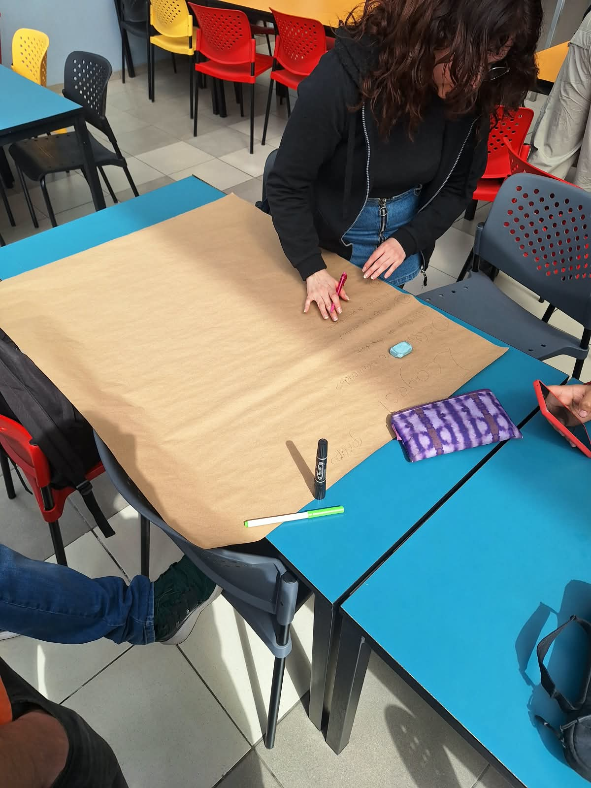
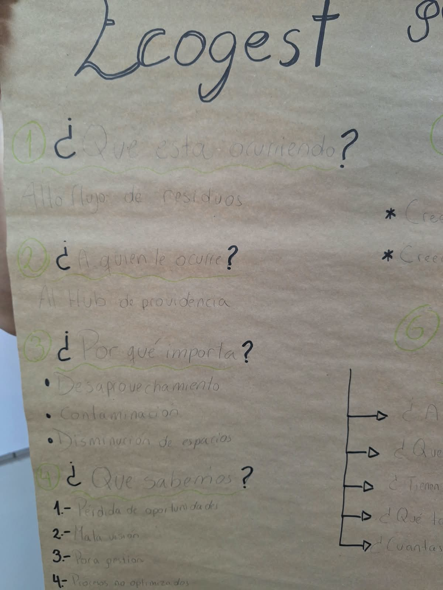
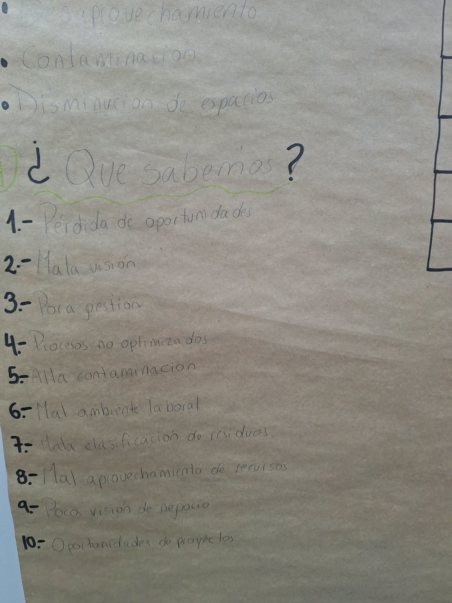
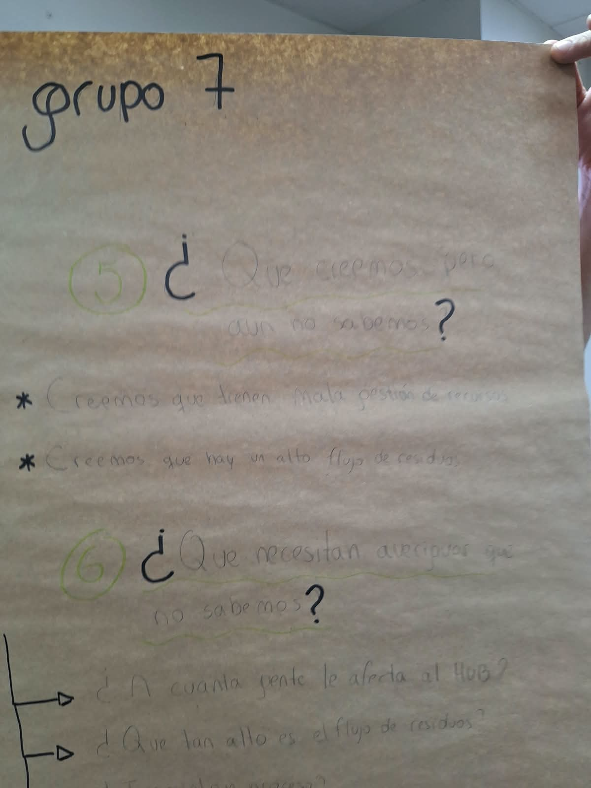
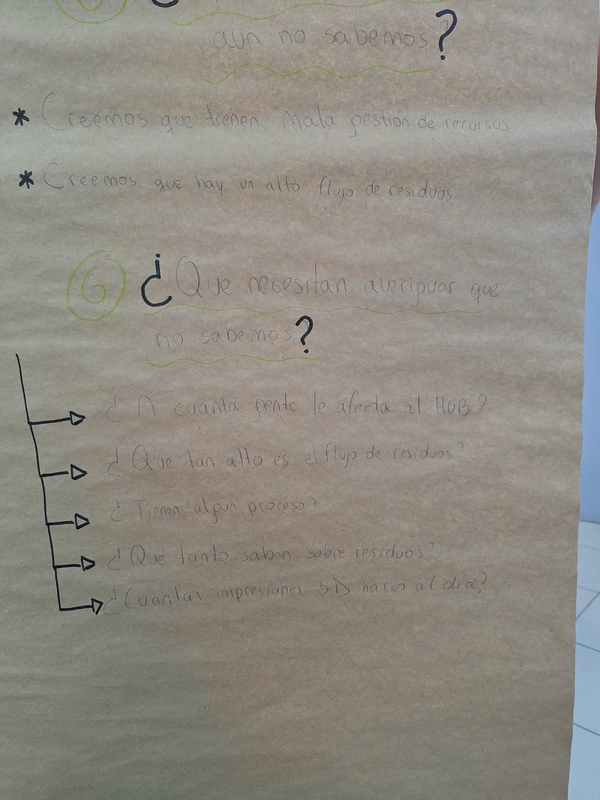

# S03 - Presentación Evaluación 1 y Actividad Ficha Papelógrafo

**Fecha:** 01-09-2026  
**Participantes:** Benjamín Santibáñez, Vicente Salas, Matías Seguel, Sebastián Ayala, Paloma Muñoz  
**Responsable del registro:** Matías Seguel

## Objetivo

Realizar la presentación de la Evaluación 1 del curso, la cual contemplaba un análisis del problema general del Hub Providencia, los actores involucrados, la información disponible actualmente y el plan de trabajo del equipo EcoGest. Posteriormente, realizar la ficha del problema en un papelógrafo con un análisis de distintos puntos del desafío, incluyendo actores, ideas previas del grupo e información que necesita el equipo para continuar avanzando.

## Actividades realizadas

1. Presentación Evaluación 1: EcoGest – Gestión y Medición de Residuos Reciclables del Hub Providencia
2. Realización de ficha de análisis del tema en papelógrafo

## Evidencias

## Resultados

La presentación cubrió las tres fases planificadas: análisis de la problemática (inexistencia de registro, falta de métricas y dificultad para la economía circular), el enfoque Design Thinking identificando los actores clave (equipo de gestión del Hub y labs/usuarios del edificio), y la propuesta de solución EcoGest con su Producto Mínimo Viable compuesto por el prototipo de registro, la metodología piloto y el panel de indicadores. La actividad cumplió con el objetivo general, aunque se identificaron puntos de mejora relacionados con la inclusión explícita de los objetivos SMART dentro de la presentación, ya que se asumió que eran suficientes en la bitácora de GitHub.

La ficha del papelógrafo se completó a tiempo e incorporó elementos visuales para destacar los puntos clave del análisis.

## Aprendizajes

A partir de los puntos de mejora señalados por el docente, el equipo concluye que es necesario consultar con anticipación al docente sobre los requisitos específicos de cada entrega, en lugar de asumir qué contenidos van en cada formato. Verificar el alineamiento entre la presentación y la bitácora antes de la evaluación es una práctica que el equipo adoptará de aquí en adelante.

## Tareas y responsables

| Tarea | Responsable(s) | Fecha límite | Estado |
|---|---|---|---|
| Coordinar la presentación y apoyar con la ficha | Benjamín Santibáñez | 01-09-2026 | Realizado |
| Analizar el proceso y apoyar con la ficha | Vicente Salas | 01-09-2026 | Realizado |
| Apoyar con la ficha y registrar en la bitácora | Matías Seguel | 01-09-2026 | Realizado |
| Diseño y elaboración de la ficha papelógrafo | Paloma Muñoz | 01-09-2026 | Realizado |
| Estructura de datos y apoyar con la ficha | Sebastián Ayala | 01-09-2026 | Realizado |

## Fuentes consultadas

- EcoGest Team, *EcoGest: Gestión y Medición de Residuos – Presentación Evaluación 1*, Capstone Intermedio 2026, Universidad Mayor.
- Sortaider, *Office bins for recycling* – https://sortaider.com
